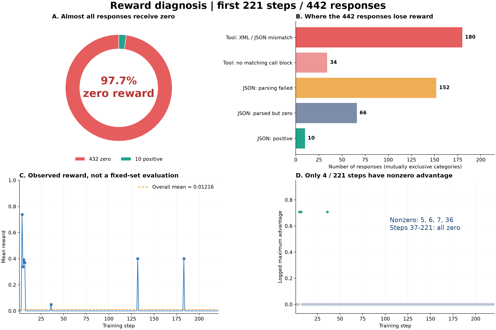

# Qwen3.8 LoRA GRPO 低奖励分析

分析日期：2026-09-12（UTC）  
分析范围：本次实验前 221 步，共 442 个回答；不是整个训练的最终结果。  
实验：Qwen3.8-27B-LoRA-FSDP2-MIG67G-ReferenceReward

## 一眼看懂：证据总览

**442 个回答 → 432 个零分 → 217/221 步组内同分 → 只有 4 步产生非零 advantage。**



图 A：97.7% 的回答零分。图 B：五类互斥原因覆盖全部 442 个回答；“XML 协议不匹配”不是对其语义正确性的判断。图 C：逐步平均 reward，虚线为整体均值；不同步对应不同样本，不能作为固定验证集的能力趋势。图 D：SwanLab 实测 advantage，仅第 5、6、7、36 步非零。

| 回答分类（互斥） | 数量 | 占全部回答 |
| --- | --- | --- |
| 工具任务：XML 与 JSON 解析协议冲突 | 180 | 40.7% |
| 工具任务：没有匹配到要求的调用块 | 34 | 7.7% |
| JSON 任务：解析失败 | 152 | 34.4% |
| JSON 任务：解析成功但得零分 | 66 | 14.9% |
| JSON 任务：获得正分 | 10 | 2.3% |

### 实际样例：回答正确到什么程度，为什么仍是零分

| 位置 | 模型实际输出 | 参考答案 / 评分要求 | 实际分数与解释 |
| --- | --- | --- | --- |
| 第 174 步，第 2 个回答 | XML 调用 ai_assistant_video；prompt=水果在盘子里自己切好摆盘，镜头垂直俯拍；duration=15s；resolution=1 : 1 | 同一个工具，三个参数值相同；解析器要求调用内部为 JSON | 0：参数一致，但 XML 无法按 JSON 解析 |
| 第 37 步，第 1 个回答 | keywords：出租屋 必备用品 | keywords：出租屋必备用品 | 0：多一个空格，字符串不严格相等 |
| 第 5 步，解析失败回答 | 解释文字之后附带 JSON 代码块 | 要求整个最终输出直接是 JSON | 0：在字段评分前就被格式检查拒绝 |

完整样例保留在下方 examples.json，包含原始 output、expected、step、sample 和 score；不把精简展示当作完整生成内容。

### 可下载、可复核的数据

- [逐步证据 CSV](2026-09-12-qwen38-grpo-low-reward-analysis-assets/step-evidence.csv)：每步两个分数、平均分、极差和是否存在组内差异。
- [逐回答证据 CSV](2026-09-12-qwen38-grpo-low-reward-analysis-assets/answer-evidence.csv)：442 个回答的类型、得分、解析结果与归因分类。
- [原始样例 JSON](2026-09-12-qwen38-grpo-low-reward-analysis-assets/examples.json)：上面三个例子的完整生成文本和参考答案。
- [统计摘要 JSON](2026-09-12-qwen38-grpo-low-reward-analysis-assets/summary.json)：报告核心统计。
- [SwanLab 指标快照 JSON](2026-09-12-qwen38-grpo-low-reward-analysis-assets/swanlab-metrics.json)：前 221 步的 advantage、pg_loss、KL、梯度、学习率和 clip_ratio。
- [矢量证据图 SVG](2026-09-12-qwen38-grpo-low-reward-analysis-assets/evidence-overview.svg)：适合放大或用于汇报。

## 结论

奖励规则与模型原生工具调用格式、任务内容不匹配，使绝大多数回答得到零分。每个 prompt 只采样两个回答，组内奖励又几乎总是相同，导致 GRPO 几乎没有任务奖励驱动的学习信号。继续延长当前训练或单独调大学习率，无法解决这些已确认的问题。

本报告依据 SwanLab 实际指标、本地生成记录和当前奖励函数代码。分析过程中未修改训练代码、奖励规则，也未停止训练。

## 数据来源与复核范围

- [SwanLab 实验页面](https://swanlab.cn/@yyq90/GRPO-Qwen3.8-Smoke/v1/lo7lkd/runs/r0u5ljmm/chart)：读取时状态为 RUNNING。
- 本地回答：`logs/rollouts/Qwen3.8-27B-LoRA-FSDP2-MIG67G-ReferenceReward/{1..221}.jsonl`。每步两个回答，包含 input、output、gts、score、step、uid。
- 奖励代码：`/shared/users/yangyq/data/recipe_v2_fixed/tf_rl/reward.py`。
- 输入与采样代码：同目录的 `rendering.py`、`dataset.py`、`agent_loop.py`。
- GRPO 实现：`verl/trainer/ppo/core_algos.py`，`compute_grpo_outcome_advantage`。
- 代码基点：个人分支提交 `d5d24f87`，父提交 `89dad2d7`。外部 recipe 文件不包含在此提交中，报告反映分析时读取的文件内容。

已离线复算成功解析的 JSON 回答，其重算分数与记录分数在 1e-5 容差内一致。此项验证支持当前 JSON 评分逻辑能解释日志中的分数；没有对所有工具调用完成兼容解析后的重评分。

## 关键统计

| 指标 | 前 221 步结果 |
| --- | --- |
| 回答总数 | 442 |
| 平均 reward | 0.01216044 |
| 零分回答 | 432 / 442（97.7%） |
| 正分回答 | 10 / 442（2.3%） |
| 工具调用任务 | 214 个回答，全部零分 |
| JSON 任务 | 228 个回答，218 个零分 |
| 组内奖励相同 | 217 / 221 步（98.2%） |
| advantage 和 pg_loss 非零 | 仅第 5、6、7、36 步 |
| 学习率 | 全程为 3e-6 |
| 观测到的最长响应 | 1154 tokens，未达到 4096 上限 |

| 步数窗口 | 平均 reward | 正分回答数 |
| --- | --- | --- |
| 1–50 | 0.03774916 | 6 / 100 |
| 51–100 | 0 | 0 / 100 |
| 101–150 | 0.00800000 | 2 / 100 |
| 151–200 | 0.00800000 | 2 / 100 |
| 201–221 | 0 | 0 / 42 |

配置为 `data.shuffle=False`，这些窗口对应不同训练样本，不能据此认定模型能力随时间下降。是否提升应通过固定验证集比较。

## 根因一：原生工具调用格式与奖励解析器冲突

实际输入模板要求在 `<tool_call>` 内使用 `<function=...>` 和 `<parameter=...>`。`rendering.py` 第 35 行调用模型自己的 `apply_chat_template`；实际 rollout 的 input 可以直接确认该要求。

模型输出示例：

```text
<tool_call>
<function=ai_assistant_video>
<parameter=duration>
15s
</parameter>
</function>
</tool_call>
```

但 `reward.py` 第 37–55 行只接受工具调用内部为 JSON；第 47 行直接执行 `strict_json(m.group(1))`。它期望的格式是：

```json
{"name":"ai_assistant_video","arguments":{"duration":"15s"}}
```

这段 JSON 必须包在 `<tool_call>` 标签内。解析器还禁止标签外出现解释文字，而实际模板允许在工具调用前出现自然语言解释，两者也存在冲突。

214 个工具任务回答中，180 个包含 XML 工具调用，34 个没有匹配到解析器要求的工具调用块；全部得到零分。180 个回答并不因此都被判定为语义正确，但其 XML 格式本身已足以导致当前解析失败。

明确样例：第 174 步第二个回答调用 `ai_assistant_video`，视频 prompt、duration=`15s`、resolution=`1 : 1` 均与参考答案一致，且没有额外解释文字，仍因 XML 与 JSON 格式冲突得到 0 分。

## 根因二：自由文案被当成确定性字段精确匹配

`reward.py` 第 110–115 行将预测和参考 JSON 拆成叶子字段，仅当字段路径和值完全相等时计分：

```text
agreement = 2 × 匹配叶子数 / (预测叶子数 + 参考叶子数)
score = 0.8 × agreement + 0.2 × 完全一致标记
```

字符串必须整段一致，数组还按元素位置比较。JSON 包装并不意味着内部内容有唯一标准答案。实际样本包含 `related_questions`、`advices`、`inspiration`、`opening_remarks` 等开放文案字段，合理改写也可能完全没有匹配叶子。

228 个 JSON 任务回答中，76 个成功解析；其中 66 个仍为零分，10 个为正分。成功解析且零分的样本包括购物建议、相关问题、创意提示等，不能仅凭零分推断其业务质量差。

明确样例：第 37 步输出 `{"keywords":"出租屋 必备用品"}`，参考为 `{"keywords":"出租屋必备用品"}`。仅一个空格差异，当前规则即给 0 分。

第 4 步的日程 JSON 则展示了部分分：结构化日期与时间一致，即使确认语不同仍能得分。这说明规则对确定性字段有作用，但对几乎全由自由文案构成的 JSON 不适合直接照搬。

## 根因三：JSON 外围文本导致整条回答归零

228 个 JSON 任务回答中，152 个未通过当前解析要求，其中 143 个报 JSON 起始解析错误，8 个输出了 XML 工具调用，1 个报额外数据错误。解析错误原因与具体输出内容需结合查看，不能将所有失败统一归为代码块问题。

第 5 步的一个实际回答先解释日程信息，再在 Markdown 代码块中给出 JSON。当前样本 `allow_fence=False`，解析器要求整个最终文本直接是 JSON，因而整条回答归零。

这类格式失败会在字段比较前截断奖励。仅提高答案字段准确性，仍可能完全得不到分。部分样本还有重复工具调用、输出结构不符等行为问题，需要与纯封装格式错误区分。

## 为什么奖励长期不涨：GRPO 组内信号消失

当前设置为 `train_batch_size=1`、`rollout.n=2`、`norm_adv_by_std_in_grpo=True`。GRPO 对同一 prompt 的两个回答做相对奖励归一化：

```text
advantage = (reward - 组内平均 reward) / (组内标准差 + ε)
```

两个回答同为零分，或者同为相同的正分，advantage 都为零。217 个训练步满足这一条件。SwanLab 中 advantage 的最大值、最小值及 pg_loss 只有第 5、6、7、36 步非零，第 37–221 步全部为零，与本地奖励统计相符。

梯度范数和 KL loss 在这些步仍非零，不意味着存在有效的任务奖励学习信号。配置启用了 KL 正则；即使奖励对应的策略梯度为零，KL 项仍可产生梯度，也不能据此声称所有参数更新完全停止。

## 已检查的其他因素与限制

- 未发现达到 4096 token 响应长度上限：前 221 步最长响应为 1154 tokens。该上限不是当前零分的主要解释，但这不排除其他输出完整性问题。
- `response_length/clip_ratio` 显示 0.5–1，不能直接解释为一半或全部回答达到配置上限。`verl/trainer/ppo/metric_utils.py` 使用 `responses.shape[-1]` 作为比较长度；结合实际长度，批次张量宽度可能影响其含义。
- 学习率一直为 3e-6。没有证据将本轮主要问题归因于学习率，而零优势与解析冲突已有直接证据。
- 参考答案标注为 `unverified_teacher_after_targeted_checks`；当前分数衡量参考一致性，不等价于独立验证的业务成功率。
- 结论对应前 221 步快照。训练继续运行后，应另行采集新的指标；本报告不把 RUNNING 状态当作持续正常运行的保证。

## 建议的修复与验证顺序

1. **统一工具协议。** 支持当前模型原生 XML 调用，将工具名及参数转换为统一结构，再进行 schema 与字段验证。保留参数类型、必填项及多调用语义，明确调用前解释文字是否允许；不要只替换标签或吞掉所有异常。
2. **按任务定义奖励。** 对日期、工具名、数值、枚举等确定性字段做规则验证。对自由文案使用合适的语义评价，或先从规则奖励训练中移除；不要要求所有建议、提示语逐字复刻教师答案。
3. **明确输出格式契约。** 让提示、示例、解析器对代码块和附加解释的要求一致。若业务必须纯 JSON，应通过明确提示、格式示例或先行 SFT 提高格式成功率；不要靠任意抽取 JSON 掩盖错误行为。
4. **先离线重评分。** 使用已有 442 个回答，对照修复前后解析成功率、各任务正分率、奖励分布和组内不同分比例。加入正确 XML、错误工具名、参数类型错误、合理文案改写等有区分度的用例。
5. **再做短训练与固定验证。** 奖励正确后，结合显存预算尝试增加 rollout.n 和训练 batch；观察有效组比例、advantage、pg_loss 及固定验证集的任务成功率。不要把增加采样数当作协议修复的替代。

建议补充记录 `format_valid`、`field_accuracy`、解析失败原因、任务类型、组内奖励标准差和零优势组比例。本次可读的本地 JSONL 仅有汇总 score 等字段，没有这些奖励诊断分项，需离线解析才能定位。

## 本次交付范围

本次完成指标读取、前 221 步回答统计、JSON 分数复算和代码核对。尚未实施解析器修复、奖励重设计、重新训练或固定验证集评测。修复后的分数提升需要与真实任务质量提升分开验证。
